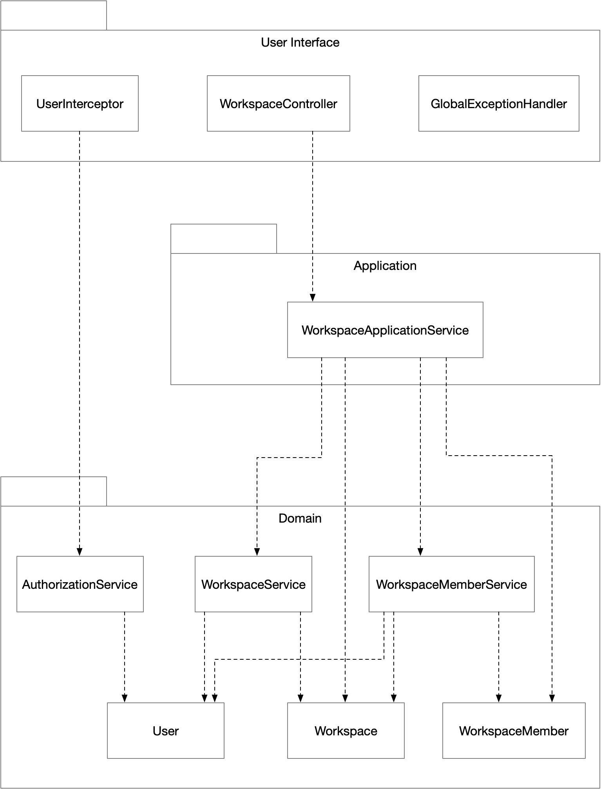
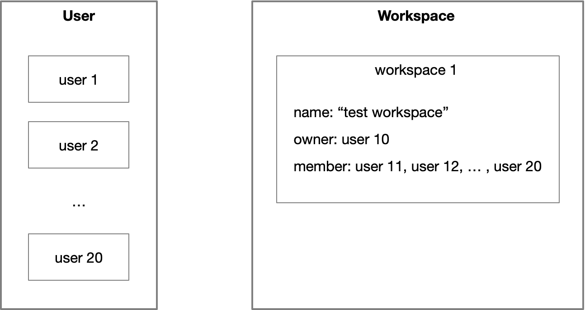

# Chequer Interview Project

## Documentation

- [Project Environment](#project-environment) 
- [Architecture](#architecture)
- [API](#api)
- [Scenario](#scenario)


## Project Environment

**Programming Language**

- Java 8

**Framework**

- Spring Boot 2.3.1
- Spring Data JPA
- JUnit 5
- Swagger 2.9.2

**Database**

- H2


## Architecture



### Domain Layer

- **User**

  An entity for user.

- **Workspace**

  An entity for workspace.  It has buisness logic like validation for workspace name, changing workspace name, etc.

- **WorkspaceService**

  A domain service for workspace. It has buisness logic like validation for user's workspace count, etc.

- **WorkspaceMember**

  An entity for workspace member. 

- **WorkspaceMemberService**

  A domain service for workspace member. It has buisness logic like validation for workspace's member count, etc.

- **AuthorizationService**

  A domain service for authorization of workspace owner.

### Application Layer

- **WorkspaceApplicationService**

  An application service using domain logic.

### User Interface Layer

- **WorkspaceController**

  A controller for API. Its basic endpoint is `/api/v1/workspaces`.

- **UserInterceptor**

  An interceptor for user authorization. 

- **GlobalExceptionHandler**

  An exception handler for catching exception and sending error response. 


## API

This project supports the following API.

- [Create workspace](#create-workspace)

- [Edit workspace name](#edit-workspace-name)
- [Add member to workspace](#add-member-to-workspace)
- [Remove workspace member](#remove-workspace-member)
- [Get workspace member list](#get-workspace-member-list)


### Create workspace

Creates workspace with workspace name. The workspace name can be 500 characters at most. Also, each user can have 5 workspaces at most. 

- **URL**

  `/api/v1/workspaces?userId=`

- **Method**

  `POST`

- **URL Params**

  `userId=[Interger]`

- **Data Params**

  ```json
  {
    "workspaceName": String
  }
  ```

- **Success Response**

  - Code: 200
    
  Content: 
    
    ```json
    {
      "ownerId": 1,
      "workspaceId": 2,
      "workspaceName": "my workspace"
    }
    ```

- **Error Response**

  - Code: 400 BAD REQUEST
    
Content:
    
    ```json
    {
      "message": "User can have 5 workspaces at most."
    }
```
    
OR
    
  - Code: 404 NOT FOUND
  
  Content:
    
    ```json
    {
      "message": "Can not find user with id 999."
  }
  ```
    
    

### Edit workspace name

Edits workspace name. The owner of workspace can only edit its name. The name can be 500 characters at most.

- **URL**

  `/api/v1/workspaces/{workspaceId}?userId=`

- **Method**

  `PATCH`

- **URL Params**

  `workspaceId=[Integer]`

  `userId=[Interger]`

- **Data Params**

  ```json
  {
    "workspaceName": String
  }
  ```

- **Success Response**

  - Code: 200
    
  Content: 
    
    ```json
    {
      "workspaceId": 1,
      "workspaceName": "our workspace"
    }
    ```

- **Error Response**

  - Code: 400 BAD REQUEST
    
Content:
    
    ```json
    {
      "message": "Workspace name should be less than 500 characters."
    }
```
    
OR
    
  - Code: 401 UNAUTHORIZED
  
  Content:
    
    ```json
    {
      "message": "You are not the owner of workspace."
  }
  ```
  
  OR
    
- Code: 404 NOT FOUND
    
  Content:
    
    ```json
    {
    "message": "Can not find workspace with id 123."
    }
  ```
    
    

### Add member to workspace

Adds member to workspace. The owner of workspace can only add member. Also, workspace can have 10 members at most. 

- **URL**

  `/api/v1/workspaces/{workspaceId}/members?userId=`

- **Method**

  `POST`

- **URL Params**

  `workspaceId=[Integer]`

  `userId=[Interger]`

- **Data Params**

  ```json
  {
    "memberId": Integer
  }
  ```

- **Success Response**

  - Code: 200
    
  Content: 
    
    ```json
    {
      "addedMemberId": 9,
      "memberCount": 2,
      "workspaceId": 1
    }
    ```

- **Error Response**

  - Code: 400 BAD REQUEST
    
Content:
    
    ```json
    {
      "message": "Workspace can have 10 members at most."
    }
```
    
OR
    
  - Code: 401 UNAUTHORIZED
  
  Content:
    
    ```json
    {
      "message": "You are not the owner of workspace."
  }
  ```
  
  OR
    
- Code: 404 NOT FOUND
    
  Content:
    
    ```json
    {
    "message": "Can not find user with id 999."
    }
```
    
  OR
  
  - Code: 409 CONFLICT
    
  Content:
    
    ```json
  {
      "message": "That user is already added to workspace."
    }
  ```
    
    

### Remove workspace member

Removes workspace member. The owner of workspace can only remove member.

- **URL**

  `/api/v1/workspaces/{workspaceId}/members/{memberId}?userId=`

- **Method**

  `DELETE`

- **URL Params**

  `workspaceId=[Integer]`

  `memberId=[Integer]`

  `userId=[Interger]`

- **Data Params**

  None.

- **Success Response**

  - Code: 200
    
  Content: 
    
    ```json
    {
      "memberCount": 1,
      "removedMemberId": 2,
      "workspaceId": 3
    }
    ```

- **Error Response**

  - Code: 401 UNAUTHORIZED
    
Content:
    
    ```json
    {
      "message": "You are not the owner of workspace."
    }
```
    
OR
    
  - Code: 404 NOT FOUND
  
  Content:
    
    ```json
    {
      "message": "That user is not added to workspace."
  }
  ```
    
    

### Get workspace member list

Gets workspace member list. 

- **URL**

  `/api/v1/workspaces/{workspaceId}/members?userId=`

- **Method**

  `GET`

- **URL Params**

  `workspaceId=[Integer]`

  `userId=[Interger]`

- **Data Params**

  None.

- **Success Response**

  - Code: 200
    
  Content: 
    
    ```json
    {
      "workspaceId": 1,
      "memberList": [
        {
          "id": 11
        },
        {
          "id": 12
        }
      ]
    }
    ```

- **Error Response**

  - Code: 404 NOT FOUND
    
Content:
    
    ```json
    {
      "message": "Can not find workspace with id 10."
    }
    ```


This format refers to [here](https://gist.github.com/iros/3426278).


If running the application, you can also check these API in [localhost:8080/swagger-ui.html](localhost:8080/swagger-ui.html) using Swagger.


## Scenario

In `src/main/resources/data.sql`, there are some query for initializing data.




There are 20 users. These 20 users each have id from 1 to 20.

There is 1 workspace named 'test workspace'. It is owned by user who has id 10. Also, 10 members are added to this workspace. Those 10 members each have id from 11 to 20. 

